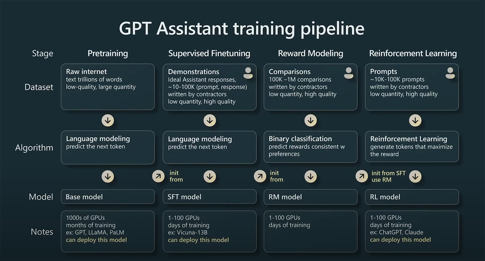

# ENVGPT

  

-----------------

# ENVGPT: A server environment automatic detection, configuration, and management tool based on a large model.
**ENVGPT** 基于大模型的服务器环境自动检测、配置与管理工具，实现包括二次预训练、有监督微调、奖励建模、强化学习训练。

分四阶段训练GPT模型，来自Andrej Karpathy的演讲PDF [State of GPT](https://karpathy.ai/stateofgpt.pdf)，视频 [Video](https://build.microsoft.com/en-US/sessions/db3f4859-cd30-4445-a0cd-553c3304f8e2)

## 😊 Feature
基于ChatGPT Training Pipeline，本项目实现了领域模型--环境配置模型的四阶段训练：

- 第一阶段：PT(Continue PreTraining)增量预训练，在海量领域文档数据上二次预训练GPT模型，以注入领域知识
- 第二阶段：SFT(Supervised Fine-tuning)有监督微调，构造指令微调数据集，在预训练模型基础上做指令精调，以对齐指令意图
- 第三阶段：RM(Reward Model)奖励模型建模，构造人类偏好排序数据集，训练奖励模型，用来对齐人类偏好，主要是"HHH"原则，具体是"helpful, honest, harmless"
- 第四阶段：RL(Reinforcement Learning)基于人类反馈的强化学习(RLHF)，用奖励模型来训练SFT模型，生成模型使用奖励或惩罚来更新其策略，以便生成更高质量、更符合人类偏好的文本

## 🚀 Training Pipeline

Training Stage:

| Stage                           | Introduction |  Python script                                                                                                           | Shell script                                                                        |
|:--------------------------------|:-------------|:------------------------------------------------------------------------------------------------------------------------|:------------------------------------------------------------------------------------|
| Stage 1: Continue Pretraining   | 增量预训练        |          [pretraining.py](https://github.com/shibing624/MedicalGPT/blob/main/pretraining.py)                     | [run_pt.sh](https://github.com/shibing624/MedicalGPT/blob/main/run_pt.sh)   |
| Stage 2: Supervised Fine-tuning | 有监督微调        | [supervised_finetuning.py](https://github.com/shibing624/MedicalGPT/blob/main/supervised_finetuning.py) | [run_sft.sh](https://github.com/shibing624/MedicalGPT/blob/main/run_sft.sh) |
| Stage 3: Reward Modeling        | 奖励模型建模       | [reward_modeling.py](https://github.com/shibing624/MedicalGPT/blob/main/reward_modeling.py)             | [run_rm.sh](https://github.com/shibing624/MedicalGPT/blob/main/run_rm.sh)   |
| Stage 4: Reinforcement Learning | 强化学习         |  [rl_training.py](https://github.com/shibing624/MedicalGPT/blob/main/rl_training.py)                     | [run_rl.sh](https://github.com/shibing624/MedicalGPT/blob/main/run_rl.sh)   |

#### Supported Models
The following models are tested:

bloom:
- [bigscience/bloomz-560m](https://huggingface.co/bigscience/bloomz-560m)
- [bigscience/bloomz-1b7](https://huggingface.co/bigscience/bloomz-1b7)
- [bigscience/bloomz-7b1](https://huggingface.co/bigscience/bloomz-7b1)

llama:
- [shibing624/chinese-alpaca-plus-7b-hf](https://huggingface.co/shibing624/chinese-alpaca-plus-7b-hf)
- [shibing624/chinese-alpaca-plus-13b-hf](https://huggingface.co/shibing624/chinese-alpaca-plus-13b-hf)
- [minlik/chinese-llama-plus-7b-merged](https://huggingface.co/minlik/chinese-llama-plus-7b-merged)
- [shibing624/chinese-llama-plus-13b-hf](https://huggingface.co/shibing624/chinese-llama-plus-13b-hf)
- [decapoda-research/llama-7b-hf](https://huggingface.co/decapoda-research/llama-7b-hf)
- [IDEA-CCNL/Ziya-LLaMA-13B-v1](https://huggingface.co/IDEA-CCNL/Ziya-LLaMA-13B-v1)

chatglm:
- [THUDM/chatglm-6b](https://huggingface.co/THUDM/chatglm-6b)

baichuan:
- [baichuan-inc/baichuan-7B](https://huggingface.co/baichuan-inc/baichuan-7B)

## 💻 Inference 

## 📚 Dataset 

我们既可以基于GPT，也可以基于其他任何闭源、开源大模型进行集成开发。我们可以调用API、微调大模型，可以自己从头训练一个模型。更重要的是数据和实际用户：我们有大量实际数据，有各行业的真实用户，这是最为重要的。

论文、专利coming soon！

项目会开源，可能推出企业版。

团队：航天、北京交通大学、吉林大学、中国移动
